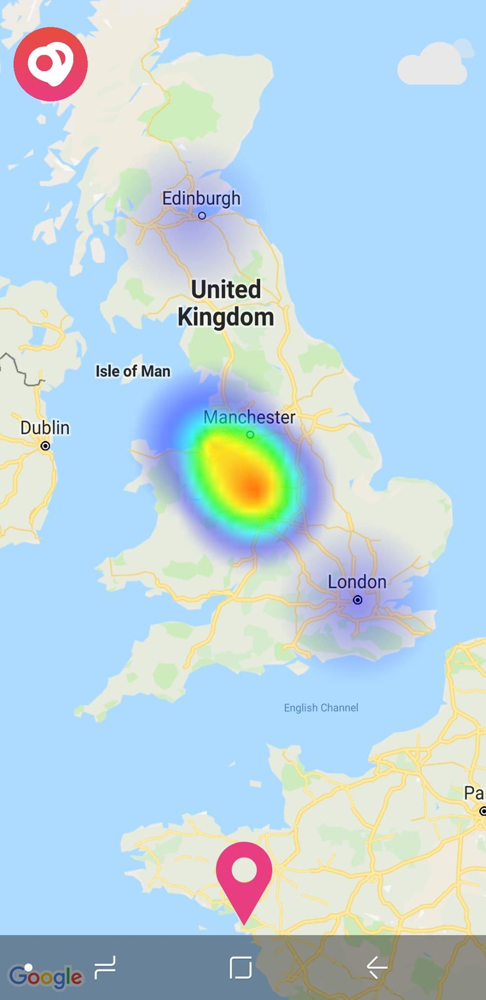
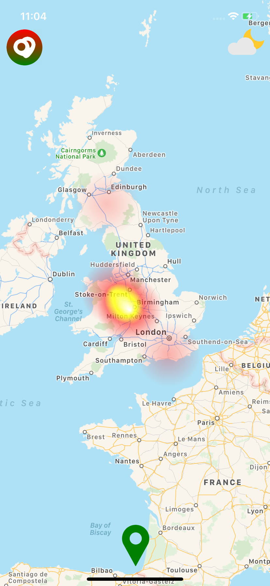

# react-native-heat-map
A <HeatMap /> component for React Native that can be rendered on top or underneath your `<View/>`s with transparency. If you don't feel like using a native library, you might be  interested in [react-native-simpleheat](https://github.com/cawfree/react-native-simpleheat).

<table style="width:100%">
  <tr>
    <th>Android</th>
    <th>iOS</th>
  </tr>
  <tr>
    <td></td>
    <td></td>
  </tr>
</table>

The native Android solution is implemented using [simpleheat](https://github.com/mourner/simpleheat) as the development reference. On iOS, the heatmap is presented using the performant [LFHeatMap](https://github.com/gpolak/LFHeatMap) as a CocoaPods dependeny. This is **not** a `<MapView/>`; but it can be overlaid one.

## 🚀 Getting started

Using [`npm`]():

```sh
$ npm install @cawfree/react-native-heat-map --save
```

Using [`yarn`]():

```sh
yarn add @cawfree/react-native-heat-map
```

### 🤖 Mostly automatic installation

If you're running `react-native` at any version less than `0.60.0`, you'll need to manually link the library to your project:

```sh
$ react-native link react-native-heat-map
```

### 🔩 Manual installation

#### iOS

1. In XCode, in the project navigator, right click `Libraries` ➜ `Add Files to [your project's name]`
2. Go to `node_modules` ➜ `react-native-heat-map` and add `HeatMap.xcodeproj`
3. In XCode, in the project navigator, select your project. Add `libHeatMap.a` to your project's `Build Phases` ➜ `Link Binary With Libraries`
4. Run your project (`Cmd+R`)<

#### Android

1. Open up `android/app/src/main/java/[...]/MainApplication.java`
  - Add `import io.github.cawfree.HeatMapPackage;` to the imports at the top of the file
  - Add `new HeatMapPackage()` to the list returned by the `getPackages()` method
2. Append the following lines to `android/settings.gradle`:
  	```
  	include ':react-native-heat-map'
  	project(':react-native-heat-map').projectDir = new File(rootProject.projectDir, 	'../node_modules/react-native-heat-map/android')
  	```
3. Insert the following lines inside the dependencies block in `android/app/build.gradle`:
  	```
      compile project(':react-native-heat-map')
  	```

## ✍️ Example

There are two main modes the `<HeatMap/>` can operate in. You can either specify cartesian (2D) co-ordinates:

```javascript
import HeatMap from 'react-native-heat-map';

export default () => (
  <HeatMap
    pointerEvents="box-only"
    style={{
      flex: 1,
    }}
    data={[
      [
        100, // x
        100, // y
        20   // intensity
      ],
    ]}
  />
);
```

Alternatively, you can pass a [react-native-maps](https://github.com/react-native-community/react-native-maps)-compatible `region` prop to process your data through a [Web Mercator Projection](https://en.wikipedia.org/wiki/Web_Mercator_projection):

```javascript
import HeatMap from 'react-native-heat-map';

export default () => (
  <HeatMap
    pointerEvents="box-only"
    style={{
      flex: 1,
    }}
    data={[
      [
        -3.0118499, // longitude
        53.4139281, // latitude
        20   // intensity
      ],
    ]}
    region={{
      longitude: -3.0118499,
      latitude: 53.4139281,
      latitudeDelta: 0.2,
      longitudeDelta: 0.2,
    }}
  />
);
```

For performance, instead of using `setState` to update the `<HeatMap />`, you can choose to [`setNativeProps`](https://facebook.github.io/react-native/docs/direct-manipulation) directly.

Check out the complete [example code](https://github.com/cawfree/react-native-heat-map/blob/master/example/App.js).

## 📌 Props

Prop                  | Type     | Default                   | Required
--------------------- | -------- | ------------------------- | --------
max|number|10|No
data|array|[]|No
minOpacity|number|0.05|No
alpha|number|1.0|No
region|shape|null|No

## ✌️ License
[MIT](https://opensource.org/licenses/MIT)
